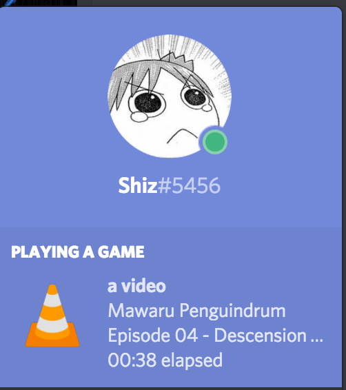
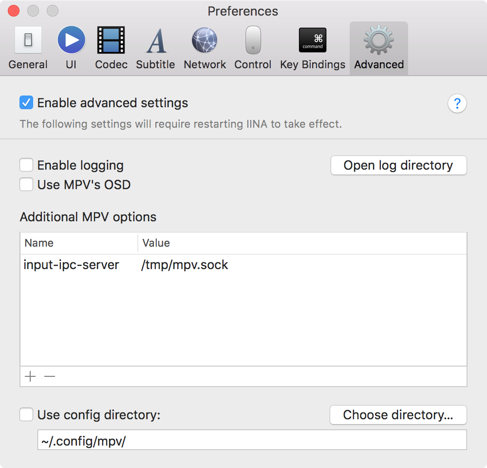
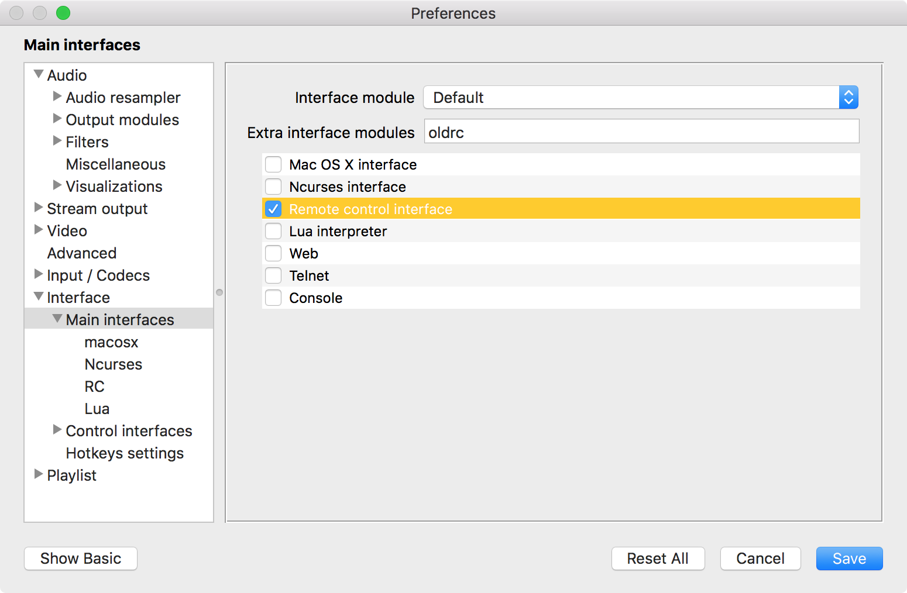
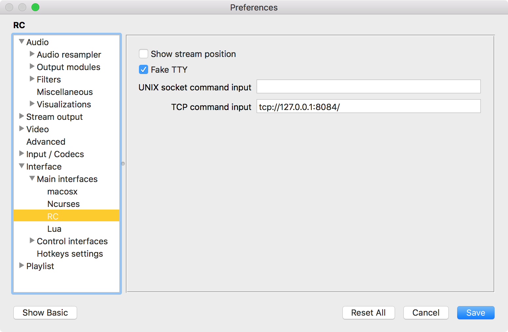
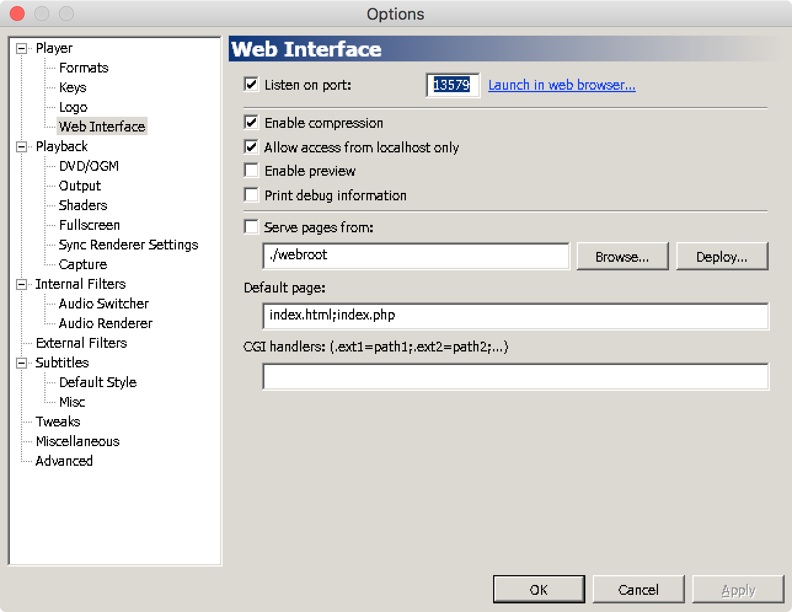

# nene

<p align="center"></p>

<p align="center"><em>Ne, ne... watcha playin'?</em></p>

## Nani?

**nene** is a ~~program~~ ~~sentient AI~~ cute anime girl that will try to fetch information from your media player
and broadcast your questionable taste to the entire world over Discord! It currently supports the following players:

* [mpv](https://mpv.io) / [IINA](https://lhc70000.github.io/iina/)
* [VLC](https://www.videolan.org/vlc/index.html)
* [MPC-HC](https://mpc-hc.org/)

## How does it look?

If all properly set up and working, it should look a little bit like this:



Pretty nifty, right? The icon will show which media player you're currently using,
and nene will do her best to extract title and episode information from the file name and title!

## Setup

In order for nene to be able to reach and understand your media players, you need a tiny bit of setup for each player.

### mpv

nene needs the IPC functionality enabled! Add the following to `~/.config/mpv/mpv.conf`, or to IINA's parameters (Advanced -> Additional MPV options):

```ini
input-ipc-server = /tmp/mpv.sock
```

After restarting mpv / IINA it should work!



### VLC

nene needs the RC functionality to work! Open your preferences, click "Show all", and then navigate to "Interface -> Main interfaces".
In there, enable "Remote control interface". Then, go to the "RC" submenu, enable "Fake TTY", and enter `tcp://127.0.0.1:8084/` in "TCP command input".

After restarting VLC, nene should be able to access your titles!




### MPC-HC

nene desires the web UI to work before she can do her thing! Open the options, go to "Player -> Web Interface",
and enable "Listen on port" and "Allow access from localhost only".
Then enter "13579" as the port number, and after restarting you're ready to tell everyone about your obscure cartoons!



## License

nene is a strong independent girl, and appropriately but nevertheless licensed under the [0BSD](https://spdx.org/licenses/0BSD.html) license:

```
Copyright (C) 2018 by Shiz <hi@shiz.me>

Permission to use, copy, modify, and/or distribute this software for any purpose with or without fee is hereby granted.

THE SOFTWARE IS PROVIDED "AS IS" AND THE AUTHOR DISCLAIMS ALL WARRANTIES WITH REGARD TO THIS SOFTWARE INCLUDING ALL IMPLIED WARRANTIES OF MERCHANTABILITY AND FITNESS. IN 
NO EVENT SHALL THE AUTHOR BE LIABLE FOR ANY SPECIAL, DIRECT, INDIRECT, OR CONSEQUENTIAL DAMAGES OR ANY DAMAGES WHATSOEVER RESULTING FROM LOSS OF USE, DATA OR PROFITS, 
WHETHER IN AN ACTION OF CONTRACT, NEGLIGENCE OR OTHER TORTIOUS ACTION, ARISING OUT OF OR IN CONNECTION WITH THE USE OR PERFORMANCE OF THIS SOFTWARE.
```
